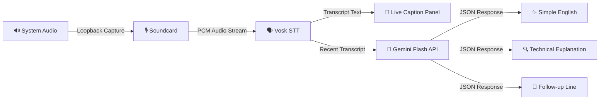

<](https://python.org)
[](https://ai.google.dev/)
[](https://alphacephei.com/vosk/)
[](https://www.microsoft.com/windows)
[](LICENSE)

<br/>

> **Struggling to keep up with fast-paced English in technical meetings?**<br/>
> This desktop app listens to your meeting audio in real-time, generates live captions using offline speech recognition, and provides instant AI-powered explanations in simple English — right on your screen.

<br/>

</div>

---

## 🚀 What It Does

| Feature | Description |
|---------|-------------|
| 🎧 **Live Audio Capture** | Captures system audio directly from your speaker output (loopback) — works with Zoom, Google Meet, Teams, or any meeting app |
| 📝 **Real-Time Captions** | Converts speech to text locally using Vosk (no internet needed for captioning) |
| 🧠 **AI-Powered Explanations** | Sends recent transcript to Google Gemini Flash for a plain-English rewrite and technical explanation |
| 💬 **Honest Follow-Up Lines** | Suggests a clarifying reply you can use when the transcript is unclear |
| 🔒 **Fully Local STT** | Speech recognition runs entirely offline — your audio never leaves your machine |
| ⌨️ **Keyboard Shortcuts** | Quick shortcuts to start/stop, clear, and close the app |
| 📌 **Always-on-Top Window** | Stays visible during meetings with snap-below-camera positioning |
| 🖱️ **Draggable Window** | Click and drag the header to reposition the window anywhere on screen |

---

## 🖥️ App Interface

The app displays **four real-time panels**:

```text
┌──────────────────────────────────────────────┐
│  Live Caption + Simple Explanation           │
│  Built for visible accessibility support     │
│                                              │
│  ⚠️ Share only a browser tab, not your       │
│     full screen if presenting                │
│                                              │
│  [Start Listening]  [Stop]  [Clear]  [Snap]  │
│                                              │
│  ┌──────────────────────────────────────┐    │
│  │ 📝 Live Caption                      │    │
│  │ Real-time speech-to-text output      │    │
│  └──────────────────────────────────────┘    │
│  ┌──────────────────────────────────────┐    │
│  │ 🗣️ Simple English                    │    │
│  │ AI-rewritten version of what was said│    │
│  └──────────────────────────────────────┘    │
│  ┌──────────────────────────────────────┐    │
│  │ 🔍 Technical Explanation             │    │
│  │ Brief breakdown of technical meaning │    │
│  └──────────────────────────────────────┘    │
│  ┌──────────────────────────────────────┐    │
│  │ 💬 Honest Follow-up Line             │    │
│  │ A safe response you can say back     │    │
│  └──────────────────────────────────────┘    │
│                                              │
│  Ctrl+L start/stop | Ctrl+K clear | Esc close│
└──────────────────────────────────────────────┘
```

---

## 🏗️ Project Architecture

```
Crack_anything/
├── app/
│   ├── __init__.py          # Package marker
│   ├── main.py              # Entry point — initializes Tk and launches the app
│   ├── config.py            # Loads .env settings, auto-discovers Vosk model
│   ├── gemini.py            # Gemini API client with retry logic & rate-limit handling
│   ├── schemas.py           # Data classes (TranscriptSegment, AssistRequest, AssistCard)
│   ├── transcription.py     # Loopback audio capture + Vosk speech recognition
│   └── ui.py                # Tkinter-based UI with live-updating panels
├── models/                  # Place your Vosk model here (auto-detected)
│   └── vosk-model-small-en-us-0.15/
├── tests/
│   ├── test_config.py       # Unit tests for configuration loading
│   └── test_gemini.py       # Unit tests for Gemini response handling
├── vendor/
│   └── tcl/                 # Bundled Tcl/Tk runtime (optional fallback)
├── .env.example             # Template for environment variables
├── .gitignore               # Git ignore rules
└── requirements.txt         # Python dependencies
```

---

## ⚙️ Setup & Installation

### Prerequisites

- **Python 3.10+** with Tkinter support (included in standard Windows Python install)
- **Windows OS** (uses loopback audio capture via `soundcard`)
- **Google Gemini API Key** ([Get one free here](https://aistudio.google.com/apikey))

### Step 1 — Clone the Repository

```bash
git clone https://github.com/asanm11611622ubca006/Crack-Anythink-at-meeting.git
cd Crack-Anythink-at-meeting
```

### Step 2 — Install Dependencies

```powershell
python -m pip install -r requirements.txt
```

### Step 3 — Configure Environment Variables

```powershell
Copy-Item .env.example .env
```

Open `.env` and replace the placeholder with your **Gemini API key**:

```env
GEMINI_API_KEY=your_actual_api_key_here
GEMINI_MODEL=gemini-2.0-flash
VOSK_MODEL_PATH=models/vosk-model-small-en-us-0.15
CAPTION_SAMPLE_RATE=16000
CAPTION_BLOCK_SIZE=4096
EXPLANATION_DEBOUNCE_MS=5000
REQUEST_TIMEOUT_SECONDS=12
```

### Step 4 — Download a Vosk Model

Download an English Vosk model from [https://alphacephei.com/vosk/models](https://alphacephei.com/vosk/models) and extract it into the `models/` directory.

**Recommended:** [vosk-model-small-en-us-0.15](https://alphacephei.com/vosk/models/vosk-model-small-en-us-0.15.zip) (~40 MB, fast and lightweight)

```
models/vosk-model-small-en-us-0.15/
```

> 💡 The app auto-detects the first `vosk-model*` folder under `models/` if `VOSK_MODEL_PATH` is not set.

### Step 5 — Run the App

```powershell
python -m app.main
```

---

## ⌨️ Keyboard Shortcuts

| Shortcut | Action |
|----------|--------|
| `Ctrl + L` | Start / Stop listening |
| `Ctrl + K` | Clear all panels |
| `Esc` | Close the app |

---

## 🔧 Configuration Reference

All settings are controlled via the `.env` file:

| Variable | Default | Description |
|----------|---------|-------------|
| `GEMINI_API_KEY` | — | Your Google Gemini API key (required for AI explanations) |
| `GEMINI_MODEL` | `gemini-2.0-flash` | Gemini model to use |
| `VOSK_MODEL_PATH` | Auto-detected | Path to the Vosk speech model folder |
| `CAPTION_SAMPLE_RATE` | `16000` | Audio sample rate in Hz |
| `CAPTION_BLOCK_SIZE` | `4096` | Audio capture block size |
| `EXPLANATION_DEBOUNCE_MS` | `5000` | Debounce delay before requesting AI explanation (ms) |
| `REQUEST_TIMEOUT_SECONDS` | `12` | Timeout for Gemini API requests |
| `TRANSCRIPT_CONTEXT_LIMIT` | `700` | Max characters sent to Gemini per request |
| `WINDOW_WIDTH` | `560` | Initial window width |
| `WINDOW_HEIGHT` | `760` | Initial window height |

---

## 🧪 Running Tests

```powershell
python -m pytest tests/ -v
```

---

## 🔄 How It Works



1. **Audio Capture** — Captures system audio from your default speaker via loopback (no microphone needed)
2. **Speech Recognition** — Vosk processes the audio stream locally and produces real-time transcript segments
3. **AI Explanation** — After a configurable debounce period, the recent transcript is sent to Gemini Flash
4. **Smart Response** — Gemini returns structured JSON with a simple rewrite, technical explanation, and a suggested follow-up line
5. **Rate Limit Handling** — Automatic retry with exponential backoff on API rate limits (429 errors)

---

## 🎯 Who Is This For?

- 👨‍💻 **Non-native English speakers** attending technical meetings
- 🎓 **Students and freshers** joining their first team calls
- 🧑‍🏫 **Anyone** who needs to quickly understand technical jargon spoken in meetings
- ♿ **Accessibility users** who benefit from live captioning

---

## 📋 Important Notes

- ✅ The app works **without Gemini** — live captions still function if no API key is set
- ✅ Speech recognition is **fully offline** — your audio is never uploaded
- ⚠️ If you're screen-sharing in a meeting, **share only a specific window or tab**, not your full screen
- ⚠️ This app is intentionally visible — it's designed for **honest, ethical use** as an accessibility aid

---

## 🛠️ Tech Stack

| Technology | Purpose |
|------------|---------|
| **Python 3.10+** | Core application language |
| **Tkinter** | Native desktop GUI |
| **Vosk** | Offline speech-to-text engine |
| **Soundcard** | System audio loopback capture |
| **NumPy** | Audio signal processing |
| **Google Gemini Flash** | AI-powered explanations |
| **python-dotenv** | Environment variable management |
| **Requests** | HTTP client for Gemini API |

---

## 🤝 Contributing

Contributions are welcome! Feel free to:

1. Fork the repository
2. Create a feature branch (`git checkout -b feature/amazing-feature`)
3. Commit your changes (`git commit -m 'Add amazing feature'`)
4. Push to the branch (`git push origin feature/amazing-feature`)
5. Open a Pull Request

---

## 📜 License

This project is open source and available under the [MIT License](LICENSE).

---

<div align="center">

**Made with ❤️ for better meeting accessibility**

⭐ **Star this repo** if you find it helpful!

</div>
]]>
